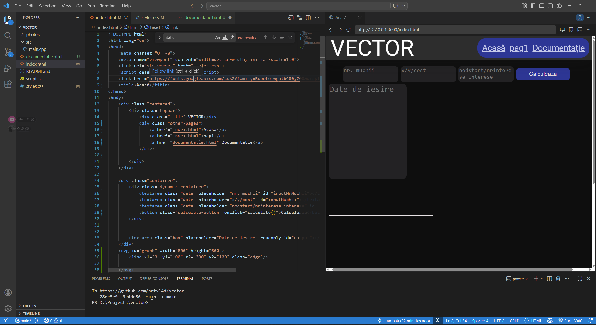
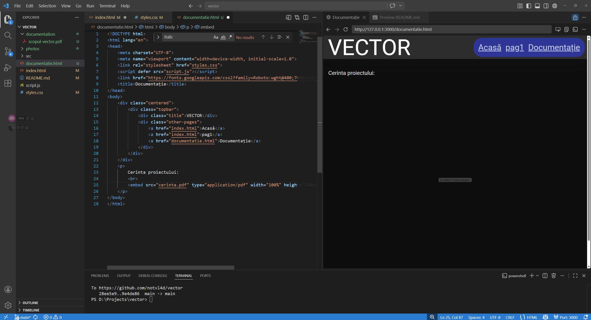
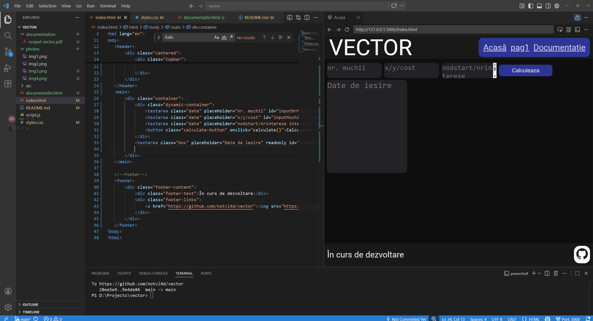
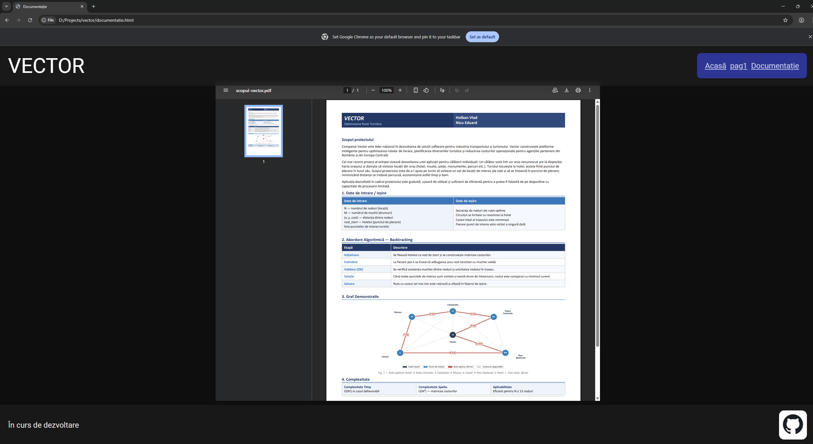
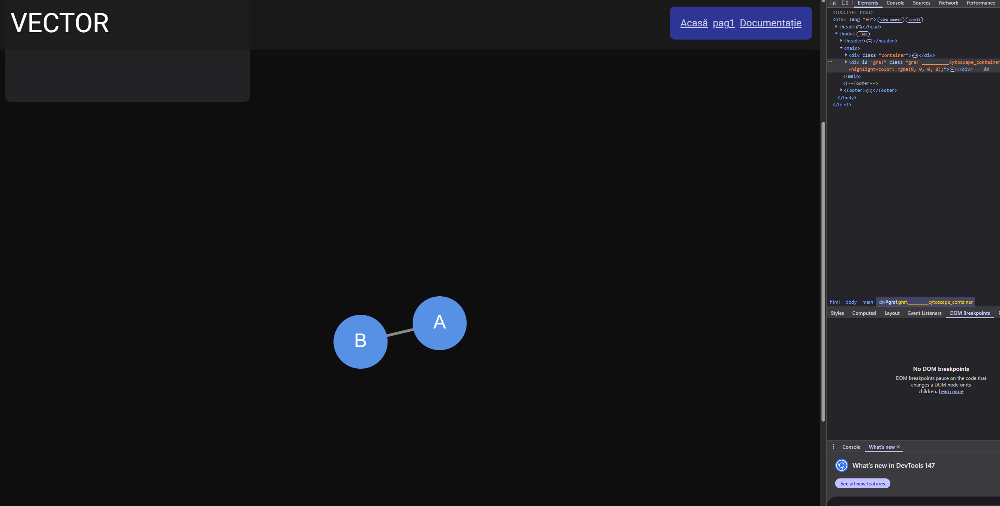
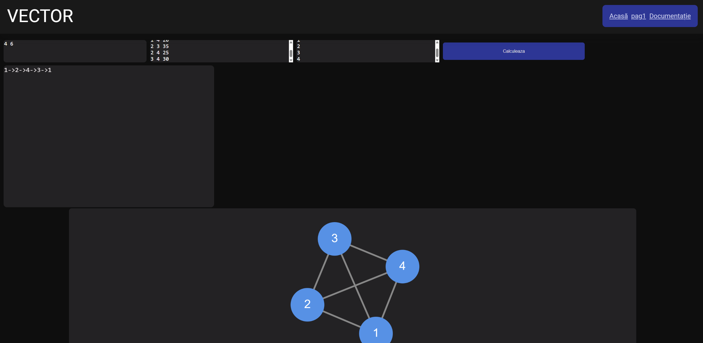

### Cerinta: Găsirea celui mai scurt drum care trece prin toate punctele de interes ale unui turist și revine la hotel, vizitând fiecare punct exact o dată.

---

[Pagina web ](https://notvl4d.github.io/vector/)

Poze

