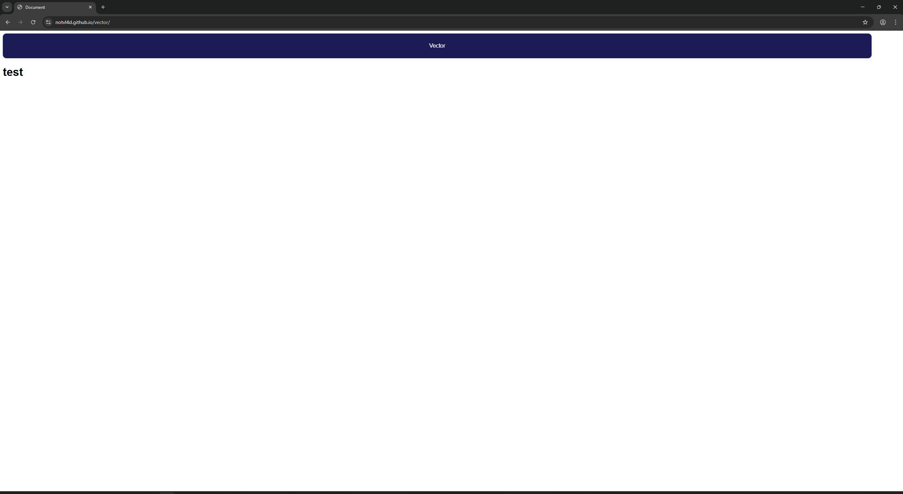
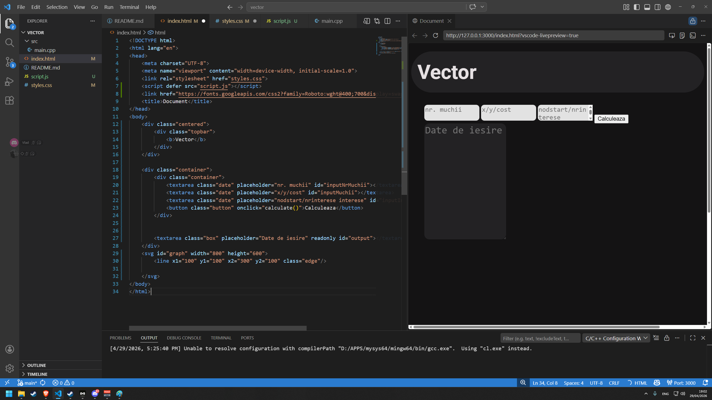
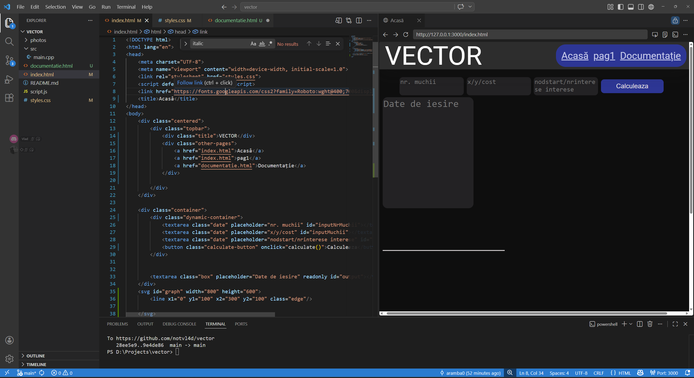
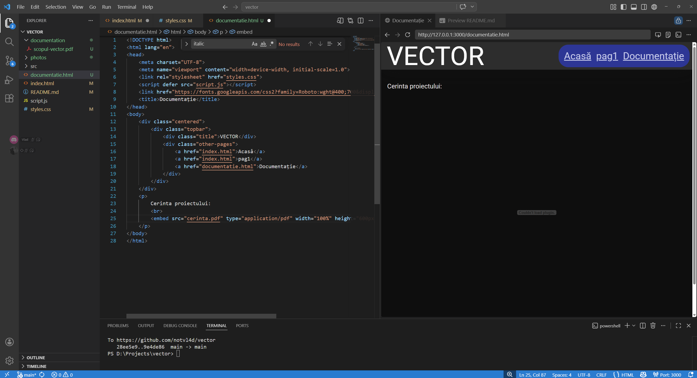
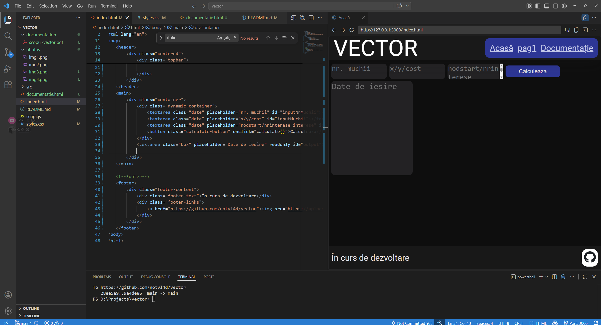
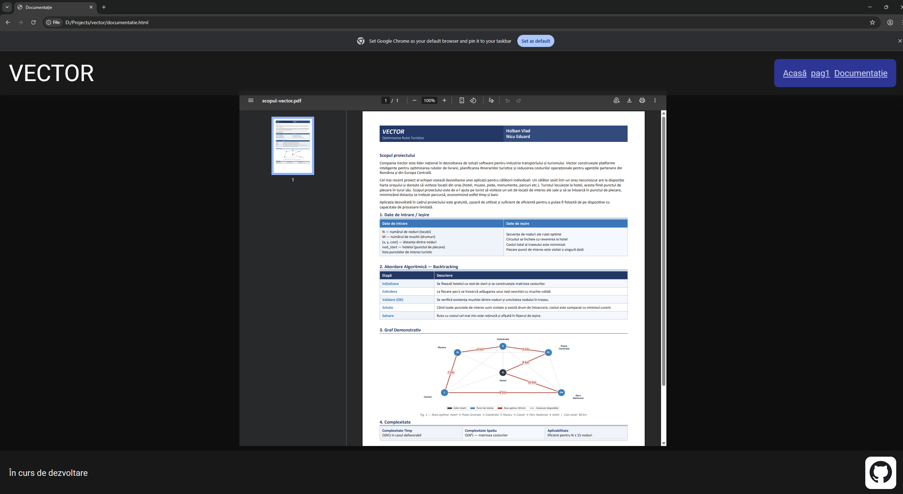
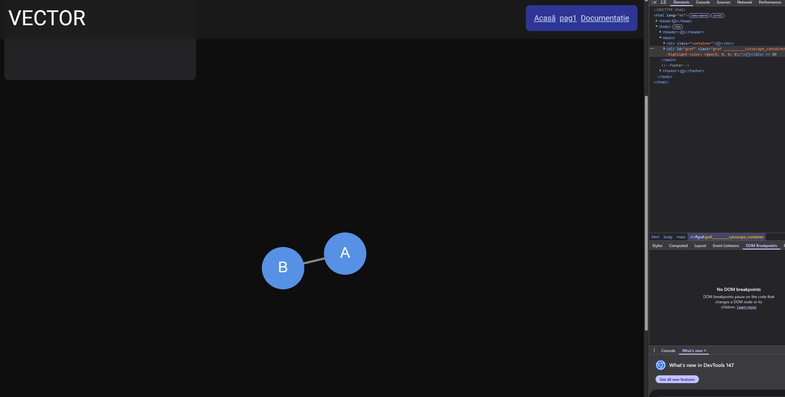
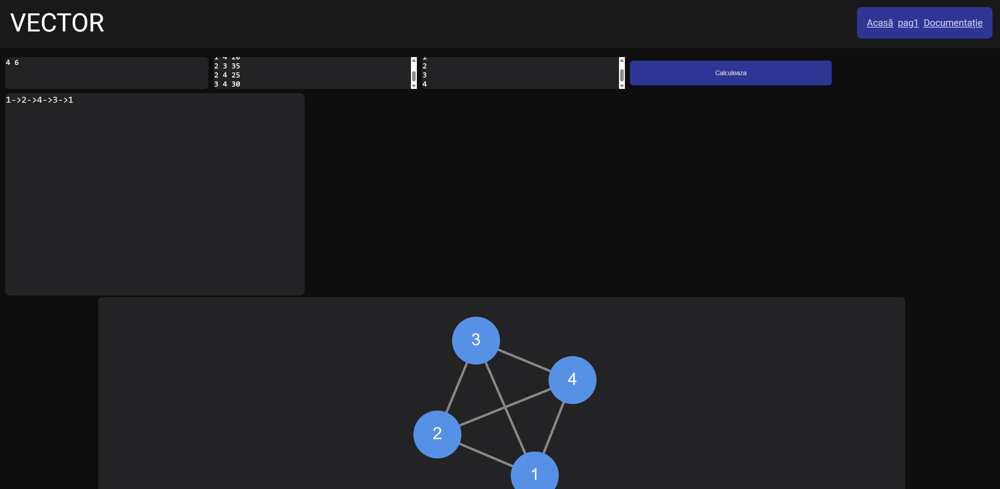

# VECTOR - Rezolvitor de Probleme de Drum Optim

## Descriere Proiect

VECTOR este o aplicație web interactivă care rezolvă **Problema Comis-Voiajorului (Traveling Salesman Problem - TSP)** cu o variație específică: găsirea celui mai scurt drum care trece prin toate punctele de interes ale unui turist și revine la hotel, vizitând fiecare punct exact o dată.

Proiectul combină o interfață web intuitiva (JavaScript + HTML/CSS) cu o implementare robustă de backtracking în C++, oferind atât vizualizare grafică interactivă cât și rezultate detaliate.

---

## Caracteristici Principale

- ✅ **Rezolvare optimă TSP** - Algoritmul backtracking găsește drumul optim cu cost minim
- 🎨 **Vizualizare grafică interactivă** - Utilizează biblioteca Cytoscape.js pentru reprezentarea grafurilor
- 📊 **Interfață web responsivă** - Design modern cu animații și UX intuitiv
- 🔢 **Suport pentru grafuri mari** - Capacitate de procesare pentru grafuri cu sute de noduri
- 💻 **Implementări duale** - Versiune JavaScript și C++ pentru maxima flexibilitate
- 📱 **Design responsiv** - Funcționează pe desktop și mobile
- 🎯 **Exemplu preîncărcat** - Buton pentru încărcare rapidă de date demonstrative

---

## Instalare

### Cerințe
- Browser modern (Chrome, Firefox, Safari, Edge)
- Pentru compilare C++: compilator GCC/Clang și Make (opțional)

### Instrucțiuni de Instalare

1. **Clonează repository-ul:**
```bash
git clone https://github.com/notvl4d/vector.git
cd vector
```

2. **Deschide aplicația web:**
   - Deschide fișierul `index.html` direct în browser
   - Sau accesează versiunea online: https://notvl4d.github.io/vector/

3. **Pentru compilare C++ (opțional):**
```bash
cd src
g++ -o main main.cpp
./main < input.txt
```

---

## Instrucțiuni de Utilizare

### Interfața Web

1. **Pagina de Pornire (`index.html`):**
   - Introduce numărul de noduri și muchii
   - Furnizează lista de muchii cu costurile asociate
   - Specifică nodul de start și punctele de interes

2. **Format de Intrare:**

   **Linia 1 (Noduri și muchii):**
   ```
   4 6
   ```
   (4 noduri, 6 muchii)

   **Liniile 2-7 (Muchii cu costuri):**
   ```
   1 2 10
   1 3 15
   1 4 20
   2 3 35
   2 4 25
   3 4 30
   ```
   (Muchie între nodurile 1 și 2 cu cost 10, etc.)

   **Linia Finală (Punct start și puncte de interes):**
   ```
   1 3
   2 3 4
   ```
   (Start din nodul 1, 3 puncte de interes: nodurile 2, 3 și 4)

3. **Butoane:**
   - **Calculeaza** - Găsește drumul optim și afișează rezultatul
   - **Exemplu** - Încarcă un set de date demonstrative preconfigurate

4. **Rezultat:**
   - Drumul optim cu ordinea nodurilor
   - Costul total al drumului
   - Reprezentare vizuală pe grafic

### Vizualizare Grafică

- **Noduri colorate** - Nodul de start și punctele de interes sunt marcate distinct
- **Muchii ponderate** - Fiecare muchie arată costul asociat
- **Drum evidențiat** - Soluția este afișată în roșu pentru ușor de urmărit

---

## Configurare

### Fișiere de Configurare

- **`styles.css`** - Stiluri pentru interfața web (culori, responsive design)
- **`index.html`** - Pagina principală a aplicației
- **`documentatie.html`** - Pagină cu documentație PDF
- **`src/main.cpp`** - Implementare C++ cu backtracking
- **`src/input.txt`** - Exemplu de fișier de intrare pentru versiunea C++

### Personalizare

Poți modifica:
- **Costurile** din fișierul de intrare
- **Structura grafului** (numărul de noduri și muchii)
- **Punctele de interes** (care noduri trebuie vizitate)
- **Stilurile CSS** din `styles.css` pentru personalizare vizuală

---

## Configurare Dezvoltare

### Structura Proiectului

```
vector/
├── index.html              # Pagina principală
├── documentatie.html       # Pagina de documentație
├── styles.css              # Stiluri CSS
├── script.js               # Logica JavaScript pentru TSP
├── graf.js                 # Vizualizare Cytoscape.js
├── harta.html              # Pagină suplimentară
├── src/
│   ├── main.cpp            # Implementare C++
│   └── input.txt           # Exemplu de intrare
├── documentation/          # Fișiere PDF de documentație
├── photos/                 # Imagini demonstrative
└── README.md               # Acest fișier
```

### Dependențe

- **Cytoscape.js** - Bibliotecă JavaScript pentru vizualizare grafuri (CDN)
- **Roboto Font** - Google Fonts pentru tipografie (CDN)

Toate dependențele sunt încărcate prin CDN, nu este nevoie de npm.

---

## Instrucțiuni de Testare

### Teste Manuale - Interfață Web

1. **Test de bază:**
   - Deschide `index.html`
   - Apasă pe butonul "Exemplu"
   - Apasă "Calculeaza"
   - Verifica dacă se afișează rezultatul și graficul

2. **Test cu date custom:**
   - Introduce manual date în format corect
   - Verifica validarea și mesajele de eroare
   - Confirma corectitudinea rezultatelor

3. **Test de vizualizare:**
   - Verifică dacă graful se renderizează corect
   - Verifica culori și text
   - Testează responsivitatea pe diferite dimensiuni de ecran

### Teste - Versiune C++

```bash
cd src
g++ -o main main.cpp
./main < input.txt > output.txt
```

Verifica fișierul `output.txt` pentru rezultate.

### Cazuri de Test Recomandate

- Grafuri mici (3-5 noduri) - pentru validare rapidă
- Grafuri medii (10-15 noduri) - pentru performanță
- Noduri izolate - pentru tratare cazuri speciale
- Cicluri - pentru validare algoritm

---

## Algoritm și Complexitate

### Abordare

- **Algoritm:** Backtracking cu verificări optimizate
- **Complexitate:** O(n!) în cazul pessim, unde n = numărul de puncte de interes
- **Optimizări:** Verificări timpurii (pruning) pentru noduri izolate

### Logica

1. Pornire din nodul specificat
2. Explorare recursivă a tuturor combinații valide
3. Respectare a constrângerilor (vizitare doar noduri cu muchii, fiecare nod o singură dată)
4. Verificare că toate punctele de interes sunt vizitate
5. Întoarcere la nodul de start
6. Menținere a soluției cu cost minim

---

## Imagini Demonstrative

Poze









---

## Documentație Detaliată

Vizitează pagina de documentație pentru detalii tehnice: [Documentație](https://notvl4d.github.io/vector/documentatie.html)

Documentația include:
- Specificații detaliate ale problemei
- Descriere pas-cu-pas a algoritmului
- Complexitate de timp și spațiu
- Exemple de execuție

---

## Link-uri Utile

- 🌐 **Pagina Web Live:** https://notvl4d.github.io/vector/
- 📝 **Repository GitHub:** https://github.com/notvl4d/vector
- 💻 **Cod C++ Online:** https://onlinegdb.com/4jmjI5HtFp

---

## Licență

Acest proiect este disponibil sub licența **MIT**.

---

## Autori

- **Holban Vlad**
- **Nicu Eduard**

---

## Note Importante

- Algoritmul are complexitate exponențială - pentru grafuri cu >20 puncte de interes, timpii de calcul pot fi considerabili
- Pentru optimizări în producție, consideră algoritmi euristici (Simulated Annealing, Genetic Algorithm)
- Aplicația validează formatul de intrare - respectă exact formatele specificate
- Vizualizarea graficului este optimizată pentru grafuri cu <50 de noduri

---

**Versiune:** 1.0  
**Ultima actualizare:** 2024